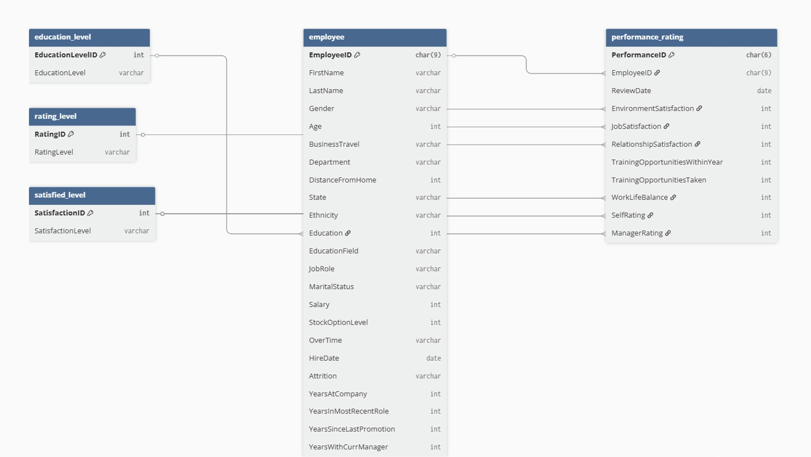

# HR EMPLOYEE ATTRITION AND PERFORMANCE ANALYSIS  

This project analyzes the HR Employee Attrition and Performance dataset to identify patterns in employee turnover, performance, satisfaction, education, and career progression. The goal is to provide actionable insights for workforce planning, retention, and HR strategy.  

## BUSINESS QUESTIONS  

1. **Workforce Overview and Attrition Metrics**  
   - Overall employee attrition rate  
   - Attrition rates and distribution by department, role, gender, and age group  
2. **Employee Performance**  
   - Distribution of employee performance ratings  
   - Attrition rates and distribution across performance levels  
3. **Satisfaction and Compensation** 
   - Relationship between job satisfaction levels and attrition  
   - Attrition rates across salary categories  
4. **Education and Career Development** 
   - Distribution of employee education levels  
   - Attrition patterns by education level and career stage  

---

## OBJECTIVES  

1. Analyze overall attrition and segment-level variations
2. Examine performance ratings and relation to attrition
3. Evaluate impact of satisfaction and salary on turnover
4. Assess effects of education and career stage
5. Deliver insights for workforce planning and retention strategies

---

## DATASET

- **Source:** [Kaggle HR Analytics Employee Attrition & Performance Dataset](https://www.kaggle.com/datasets/mahmoudemadabdallah/hr-analytics-employee-attrition-and-performance)  
- **Tables Used:** employee, performance_rating, satisfied_level, rating_level, education_level 

---

## DATA MODEL OVERVIEW 

The dataset uses a relational model with fact tables (`performance_rating`) and dimension tables (`employee`, `satisfied_level`, `rating_level`, `education_level`) connected via **primary and foreign keys** to support accurate joins and analysis.  

---

## KEY INSIGHTS  

1. **Workforce Overview and Attrition Metrics**  
    - Overall Attrition: 16.12% (237/1,470 employees); baseline for further analysis.  
    - Department: Highest rate in Sales (20.63%), HR (19.05%); Technology contributes most to total attrition (56.12%).  
    - Job Role: Sales Representatives (39.76%) and Recruiters (37.50%) at highest risk; senior/managerial roles show strong retention.  
    - Gender: Male employees highest attrition (17.51%), female moderate (15.41%), non-binary similar (15.32%).  
    - Age Groups: 18–35 contribute over 90% of attrition; 26–35 highest rate (19.52%), older employees show strong retention.   

2. **Employee Performance**  
    - Distribution: “Meets Expectation” (29.02%) and “Exceeds Expectation” (28.58%) dominate; “Above and Beyond” 20.62%, “Needs Improvement” 21.77%.  
    - Attrition Impact: High across all levels (23.51%–27.29%), top performers (“Above and Beyond”) at highest risk (27.29%).    

3. **Satisfaction and Compensation**  
    - Satisfaction: Attrition consistently high (24.38%–27.64%), even among satisfied employees; very dissatisfied have highest rate (27.64%).  
    - Compensation: Lower-salary (<$200K) employees face highest attrition (17.54%) and contribute 90.30% of exits; higher salaries show stronger retention.   

4. **Education and Career Development**  
    - Education: Majority hold Bachelor’s (38.91%) or Master’s (27.07%); high attrition among no formal qualifications (18.24%), lower for higher degrees.  
    - Career Stage: Early-career (<3 yrs) highest attrition (29.74%, 61.60% of exits); mid-career (3–8 yrs) moderate (11.60%, 35.86%); late-career (>8 yrs) minimal (2.44%).  

---

## RECOMMENDATION  

1. **Prioritize early-career and high-performer retention:**  
    Focus on structured onboarding, clear career paths, mentorship, and early promotion visibility; target “Above and Beyond” employees to reduce top-talent attrition.
   
2. **Close compensation gaps in high-risk salary bands:**  
    Review and adjust pay for employees earning <$200,000 (over 90% of total attrition) and implement transparent salary progression and performance-linked pay.
   
3. **Target high-attrition departments and roles:**  
    Strengthen retention in Sales (Sales Representatives), HR (Recruiters), and large teams like Technology through workload balance, incentives, and scalable retention initiatives.
   
4. **Strengthen career development and internal mobility programs:**  
    Expand upskilling and internal mobility for Bachelor’s and lower-education employees; formalize mid-career development pathways to prevent stagnation.
   
5. **Adopt a holistic retention strategy beyond satisfaction scores:**  
    Integrate compensation, career growth, performance recognition, and managerial effectiveness; shift from reactive exit management to proactive attrition risk monitoring using performance, tenure, and salary indicators.  
  
---

## LIMITATION  

1. **No causal insights:** Analysis shows associations but cannot determine cause-and-effect.  
2. **Static snapshot:** Attrition recorded at a single point; no temporal trends or turnover timing.  
3. **Missing external context:** Labor market, policies, leadership, or organizational changes not included.  
4. **Simplified data:** Salary bands and performance ratings may not capture role-level nuances.  

---

## TOOLS USED  

- **MySQL:** Used for relational schema design and analytical querying with joins, aggregations, and filters to support business insights.  
- **Python (Pandas) and Jupyter Notebook:** Used for data cleaning and preparation, including handling missing values and duplicates, standardizing data types and column names, and validating foreign key relationships.  
- **Markdown (.md)**: Used to document the analysis process, key insights, and business recommendations in a clear, structured format.  
- **Tableau:** Used to visualize trends and performance metrics through clear, actionable dashboards and charts.   
